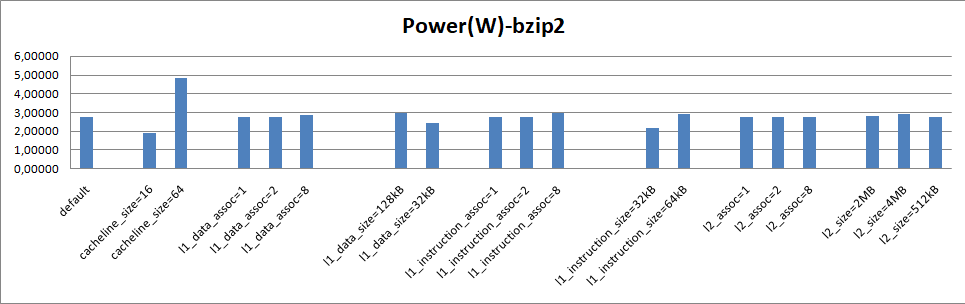
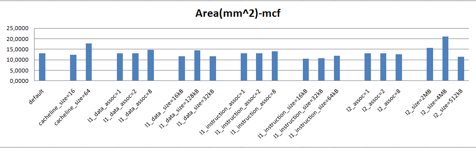
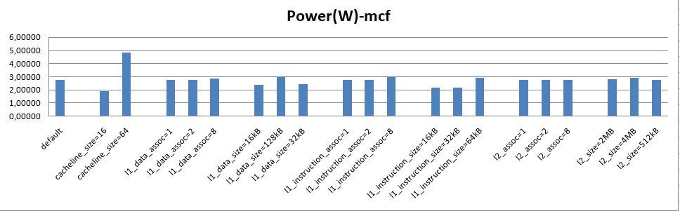
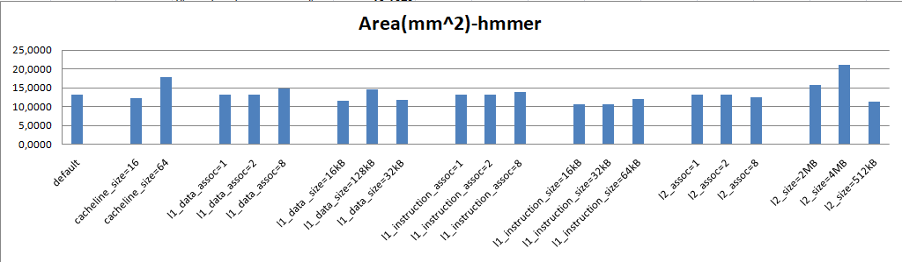
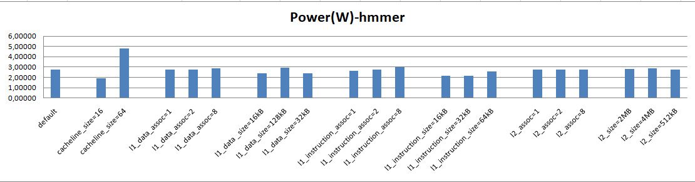
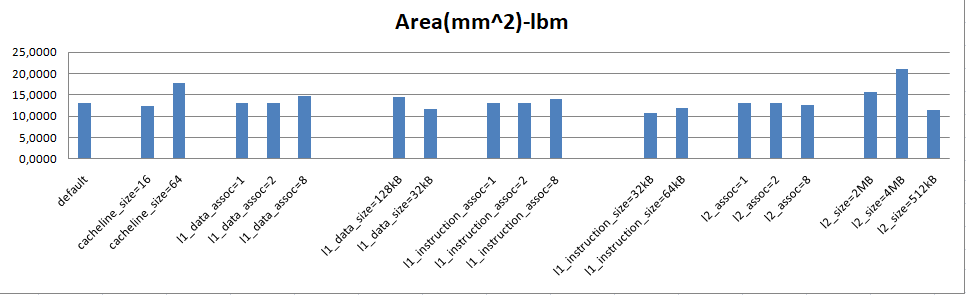
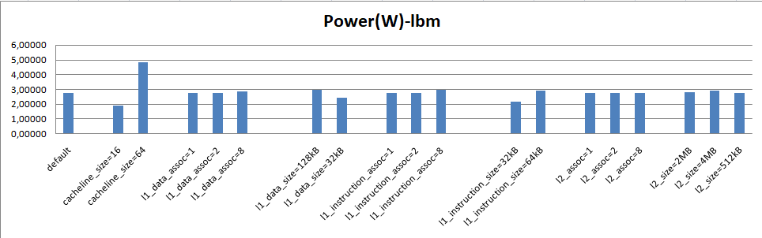

## Lab 3

### ερώτημα 1

1. a.Dynamic Power: Είναι η ενλεργεια που χρεισημοποιείτε από το κύκλωμα εν ώρα λειτουργείας. Εξαρτάται από την χωριτικότητα του συστήματος (total load capacitance), την παροχή τάσης (supply voltage) την συχνότητα του ρολογιού (cloak frequency) και τον συντελεστή δραστηριότητας (activity factor).

b. Leakage: Είναι η ενέργεια που καταναλώνεται από το σύστημα την ώρα που δεν εκτελεί κάτι. Προστείθεται στην μέση συνολική ενέργεια που καταναλώνει το σύστημα. 

c. Ένα μεγάλο χρονικά πρόγραμμα σίγουρα μειώνει το leakage καθώς δεν μένει ανενεργό (idle) το σύστημα για μεγάλο χρονικό διάστημα. Από την άλλη η Dynamic Power δεν έχει καμία άμεση εξάρτηση από τον χρονικό όγκο του προγράμματος. 

2. Θεωριτικά με καλή χρήση του επεξεργαστή που καταναλλώνει 40 Watt, ελαχιστοποίη του leakage και με σωστή εναλλαγή από τα διάφορα mode (sleep, dream) και φυσικά με σωστή επιλογή επεξεργαστή για την χρήση που χρειάζεται το σχετικό μηχάνημα θα μπορούσε ίσως να καταναλλώνει συνολικά λιγότερη μπαταρία. 

3. Ο Xeon είναι ένας επεξεργαστής με πολύ μεγάλο leakage οπότε είναι ένας επεξεργαστής που γίνεται πιο αποδοτικός ως προς την ενεργεια που καταναλλώνει όταν είναι σε συνεχή χρήση. Αντίθετα αν τρέξει μόνο μία εφερμογή και μάλιστα 40 φορές γρηγορότερα από τον Α9 στον ίδιο χρόνο που θα "περιμένει" θα έχει ξοδέψει άδικα πολύ ενέργεια λόγω του leakage. Στα αποτελέσματα που πήραμε από το mcpat βλέπουμε ότι το leakage που έχει ο Xeon είναι 36.8319 W κατά πολύ μεγαλύτερο από την ενέργεια λειτουργείας του Α9 που είναι 1.74189 W.

### ερώτημα 2
1. To Area βρίσκεται στο αρχείο results.txt που τρέξαμε για print level 5.                                    
To Energy το βρίσκουμαι τρέχοντας την παρακάτω εντολή για κάθε benchmark για κάθε αλλαγή που κάναμε στην 2η εργασία:
print_energy.py <mcpat out file> <gem5 stats file> 
 όπου -> mcpat out file = mycpu_    .xml (Πχ. mycpu_bzip2---cacheline=16.xml                                    
      -> stats file= τα stats.txt αρχεία που προκύψαν απο την 2η εργασια.
  

2. Παρακάτω παραθέτουμε γραφήματα  που παρουσιάζουν την σχέση των συντελεστών που "πειράξαμε" στη δεύτερη εργασία με το area και το power dynamic(peak power):        (Τις πληροφορίες για τους συντελεστές area και peak power τις αντλήσαμε απο τα αρχεια results.txt που προκύψαν εκτελώντας την εντολή 
./mcpat -infile my_cpu.xml -print_level 5 > results.txt)

#### **bzip2**                                                                                     
                                                                                             
                                                                             
                                                                                                                   
#### **mcf**                                                                                                                             
                                         
                                      

#### **hmmer**                                                                                                                          
                              
                              
                                                             
#### **lbm**                                                                                                                      
                        
                                                 

3.Παρατηρούμε οπως είναι προφανές απο τα γραφήματα οτι οι τιμές των area και peak power δεν μεταβάλλωνται καθόλου απο τις αλλαγές που είχαμε κάνει στην εργασία 2 με στόχο την βελτίωση της αποδοτικότητας του συστήματος μας. Άρα καταλήγουμε στο συμπέρασμα οτι οι μεταβλητές αύτες είναι ανεξάρτητές απο τα χαρακτηριστικά του συστήματος(cacheline size ,associativity,block size).Φαίνεται απο τα αρχεία results.txt ότι οι συντέλεστές αυτοί όντως είναι ανεξάρητοι όπως όλα τα χαρακτηριστικά του με εξαίρεση το runtime dynamic που είναι το μοναδίκο που επηρεάζεται απο τις αλλαγές της προηγούμενης εργασίάς.
